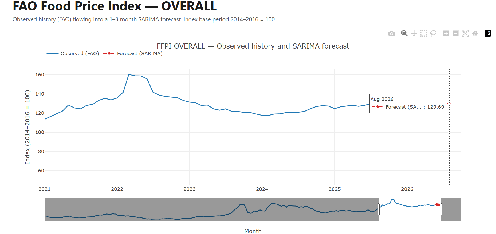

# Food Price Intel

Monthly forecasting of the **FAO Food Price Index (FFPI)** — a containerized Django app that ingests FAO's published data, forecasts it with SARIMA, and serves observed history plus forecast through an API and an interactive chart.



---

## The headline result

**SARIMA(1,1,1)(1,1,1,12) beats a random-walk baseline by ~7% at a one-month horizon, and ties it at three months.**

| model | H | folds | MAE | RMSE | MAPE % |
|---|---|---|---|---|---|
| **sarima** | 1 | 125 | **1.722** | 2.801 | 1.46 |
| naive_1 | 1 | 125 | 1.850 | 2.895 | 1.60 |
| **sarima** | 3 | 123 | **4.318** | 6.508 | 3.64 |
| naive_1 | 3 | 123 | 4.359 | 6.331 | 3.68 |
| seasonal_naive | 1 | 125 | 10.033 | 14.299 | 8.35 |
| seasonal_naive | 3 | 123 | 9.963 | 14.297 | 8.21 |

Measured on expanding-window walk-forward validation over the OVERALL FFPI series (437 contiguous months, 1990-01 → 2026-05), scored on identical folds.

That is a modest, honest result — and the modesty is the point. See below.

---

## Why the baseline matters more than the model

Most forecasting write-ups report an error metric with nothing to compare it against. A number alone is unfalsifiable.

This project establishes the bar **before** building a model, and the bar turned out to be surprising:

- **seasonal_naive** (next month = same month last year) scores MAE **10.03**. Easy to beat.
- **naive_1** (next month = this month — a one-line random walk) scores MAE **1.85**. Very hard to beat.

The FFPI is highly persistent month-to-month, so simply carrying the last value forward is a genuinely strong forecast, while seasonal-naive throws away a year of level drift. **A model that beats seasonal-naive but loses to `naive_1` is worse than one line of code.**

Beating `naive_1` by 7% at H=1 is a real but small edge. A *large* improvement over a random walk on a series like this would be evidence of a bug, not a breakthrough — which is why the sanity check flags any MAE below ~0.5 as a leakage red flag rather than a triumph.

---

## Leakage: proven caught, not assumed absent

Look-ahead leakage is the failure mode that makes a forecaster look excellent in validation and collapse in production. It is silent: it produces *better* numbers, not errors.

This repo includes a leakage probe (`apps/forecasting/tests/test_leakage.py`) that mutates every value **after** each walk-forward cutoff and asserts the prediction for that fold is byte-identical. If any future data influences a past prediction, the test fails.

Critically, the probe is verified to **bite**:

- A real look-ahead leak was deliberately planted in the forecaster → the test went **RED**, with the unmistakable signature `y_pred == y_true` (a leaking model predicts the answer exactly).
- The leak was reverted → **GREEN**.

A test that passes because it tests nothing is worse than no test. This one was shown to fail when it should.

The probe covers both the naive baselines and the SARIMA forecaster, which re-fits inside every fold on that fold's training window only — never once on the full series.

---

## Predictions never touch observations

Forecasts are stored in dedicated tables (`ForecastRun`, `ForecastPoint`), **never** in the observations table (`PriceIndexMonthly`).

This is structural, not conventional. The moment a prediction is written into the observations table, the next model training cannot distinguish fact from guess, and the model slowly learns to predict itself. Keeping them in separate tables makes that failure impossible rather than merely discouraged.

The separation is asserted programmatically: `PriceIndexMonthly.objects.count()` is unchanged (2622) after any forecast run.

**Provenance is preserved.** Each `ForecastRun` is an immutable, append-only record of *what the model predicted at a given moment, fitted through a given `train_end`* — including the SARIMA orders in `model_params`. Re-forecasting creates a new run rather than overwriting the old one, which is what makes the question *"was our June forecast any good?"* answerable six months later.

---

## Data integrity

**Base-period checksum.** The FAO index is defined as `2014-2016 = 100`. The ingest command verifies that the mean of the parsed OVERALL series over 2014-01 → 2016-12 is ≈ 100 (measured: **99.9989**, n=36). This is a free correctness oracle that falls out of the data's own definition — if the header row shifts, the nominal/real sheets swap, or FAO republishes on a new base, this number moves visibly.

**Revision-safe upserts.** FAO quietly revises prior months with each monthly release. Ingestion is keyed on `(commodity_group, period)` via `update_or_create`, so revisions **update in place** rather than duplicating. Verified by mutating a historical month in a copy of the source file, re-ingesting, and confirming the value changed while the total row count stayed at 2622.

**Full precision preserved.** FAO's workbook displays values rounded to one decimal (e.g. `128.6`) but stores full precision (`128.568848888328`). The parser stores the full value; rounding is a display concern only.

---

## Architecture

```
FAO FFPI workbook (.xlsx)
        ↓  ingest_ffpi        — base-period checksum, revision-safe upsert
   PriceIndexMonthly           — observed data only, 2622 rows
        ↓  evaluate_baseline   — expanding-window walk-forward, naive_1 + seasonal_naive
        ↓  evaluate_sarima     — same harness, same folds, re-fit per fold
        ↓  generate_forecast   — fits on full series, forecasts H months ahead
   ForecastRun / ForecastPoint — predictions + provenance, isolated from observations
        ↓  /api/forecast/overall/   — JSON: history + latest run's forecast
        ↓  /forecast/               — Plotly chart: observed → forecast
```

**Stack:** Django · PostgreSQL · Redis · Docker Compose · pandas · statsmodels · Plotly.js

**Apps:** `catalog` (commodity groups, countries, data sources) · `prices` (observed series) · `forecasting` (harness, models, forecasts, API, chart)

---

## Quickstart

Requires Docker Desktop.

```bash
# 1. Configure
cp .env.example .env

# 2. Bring up the stack
docker compose up -d --build

# 3. Migrate and seed reference data (6 commodity groups, 249 countries, 2 sources)
docker compose exec web python manage.py migrate
docker compose exec web python manage.py seed_catalog

# 4. Ingest FAO data — see note below on obtaining the file
docker compose exec web python manage.py ingest_ffpi --file data/raw/ffpi/<filename>.xlsx

# 5. Validate: baseline first, then the model against it
docker compose exec web python manage.py evaluate_baseline
docker compose exec web python manage.py evaluate_sarima

# 6. Generate and persist a forward forecast
docker compose exec web python manage.py generate_forecast --horizon 3

# 7. Open the chart
#    http://localhost:8000/forecast/
#    http://localhost:8000/api/forecast/overall/
```

Run the tests, including the leakage probe:

```bash
docker compose exec web pytest
```

### Obtaining the data

The FAO workbook is **not committed** — it's regenerable input data, not source, and FAO republishes it monthly. Download the Food Price Index data file from the [FAO Food Price Index page](https://www.fao.org/worldfoodsituation/foodpricesindex/en/) and place it in `data/raw/ffpi/`.

The ingest expects the monthly sheets `Indices_Monthly` (nominal) and `Indices_Monthly_Real` (real); the `Annual` sheets are ignored. The parser confirms the sheet structure programmatically before relying on it, and fails loudly on any missing column rather than silently dropping a series.

---

## API

`GET /api/forecast/overall/`

```json
{
  "commodity_group": "OVERALL",
  "history": [
    {"period": "1990-01", "value": 64.44},
    {"period": "2026-05", "value": 130.8}
  ],
  "forecast": {
    "model": "sarima",
    "run_id": 2,
    "train_end": "2026-05",
    "points": [
      {"period": "2026-06", "horizon_step": 1, "value": 130.35},
      {"period": "2026-07", "horizon_step": 2, "value": 129.85},
      {"period": "2026-08", "horizon_step": 3, "value": 129.69}
    ]
  }
}
```

The endpoint serves the **single most recent run's** points — it does not merge points across runs. Returns `"forecast": null` if no run exists.

---

## Notable dependency pin

`scipy==1.14.1` is pinned deliberately. scipy 1.18 removed the `disp` keyword that statsmodels 0.14.4 still passes to `fmin_l_bfgs_b`, which crashes SARIMAX fitting. 1.14.1 is the last compatible version.

---

## Scope and honest limitations

**Built:** containerized stack · FFPI ingestion with checksum and revision-safe upserts · reference catalog · expanding-window walk-forward harness with two baselines · verified leakage probe · SARIMA forecaster · forecast persistence with provenance · JSON API · interactive chart.

**Not built (deliberate):**

- **FAOSTAT country CPI ingestion.** The `CountryFoodCpiMonthly` table exists but is empty. FAOSTAT codes its areas differently from ISO/M49, so the country join is a real reconciliation task deferred to its own phase rather than rushed alongside FFPI.
- **OVERALL series only.** The 5 sub-indices (Cereals, Oils, Dairy, Meat, Sugar) are ingested and stored but not yet forecast. The harness generalizes; it just hasn't been pointed at them.
- **No SARIMA order search.** The order `(1,1,1)(1,1,1,12)` is a documented starting point, reported untuned. Tuning against the validation set until the number improves is itself a form of leakage; any future search must select orders using in-fold training data only.
- **No LightGBM.** The harness is built and leak-tested, so adding a second forecaster is now cheap — but on ~437 monthly observations of a random-walk-dominated series, gradient boosting may well lose to `naive_1`. That would be a finding worth reporting, not a failure.
- **Not deployed.** Runs locally via Docker Compose.

---

## Development notes

Every phase was verified before being committed, and the verification is the point:

- Migrations confirmed with `makemigrations --check` reporting no changes, not just a clean `migrate`.
- Seed idempotency proven by a second run creating **zero** rows — not by the first run succeeding.
- Ingestion revision-safety proven by mutating a source value and confirming an in-place update.
- The leakage probe proven by planting a leak and watching it go red.
- The chart's observed and forecast traces checked in a browser, not inferred from an HTTP 200.

Data source: [FAO Food Price Index](https://www.fao.org/worldfoodsituation/foodpricesindex/en/), CC BY 4.0.
